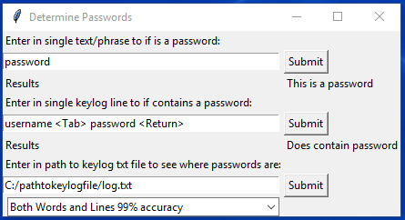
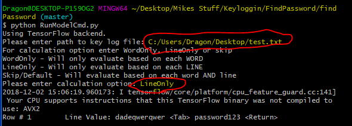

# Purpose
This is a POC to try and identify passwords from  key log file from metasploit

# Run Project with GUI
* You need to install Python 3.6 64-bit as this version of tensorflow only supports Python 3.5/3.6 64-bit
* Install dependencies, run on root of the project 'pip install -r requirements.txt'
* Start program, run on root of the project 'python RunModel.py'
* A GUI should should appear

* Do one of the following tests
    * Test a password in isolation
    * Test a line in a key log in isolation
    * Test an entire key log text file
        * Can choose 3 options to analyze file
        * The results come up in a separate window

# Run Project from Comandline
* You need to install Python 3.6 64-bit as this version of tensorflow only supports Python 3.5/3.6 64-bit
* Install dependencies, run on root of the project 'pip install -r requirements.txt'
* Start program, run on root of the project 'python RunModelCmd.py'

* Will be prompted to enter the path of the key log file
* You then be prompted to enter how you want the key log file to be analyzed
    * WordOnly - Will only evaluate based on each WORD
    * LineOnly - Will only evaluate based on each LINE
    * Skip/Default - Will evaluate based on each word AND line

# Structure Of Project
The project uses to machine learning algorithms.
* They both have a file called MakeTestDataInCsv which converts the raw data from a txt file into a csv.
* They both have a file called TrainModel which uses the training/test data csv to train the model.
* The models are then used in the RunModel file.

## Single Word Evaluation
This evaluates one word at time to determine if a given piece of text is a password.

## Key Log Line Evaluation
Looks at the context of an entire line in a log text file to see if the line contains a password.

## Results
* About 85% accuracy to detect a password by itself.
* About 96% accuracy to detect there is a password in a given line.
* About 99% accuracy if you use both models.

